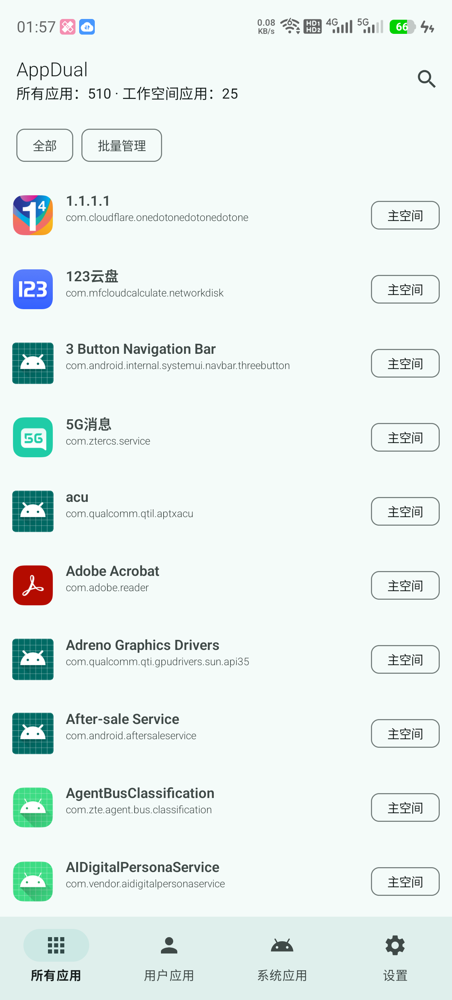
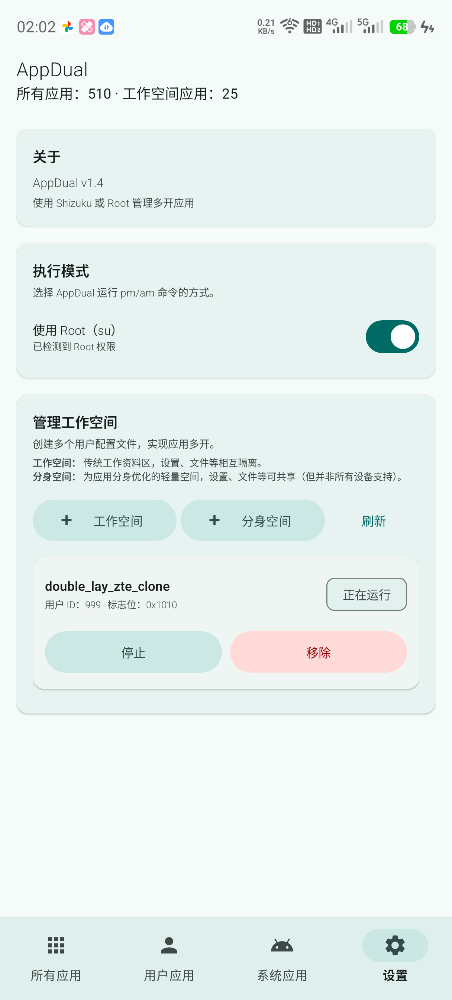
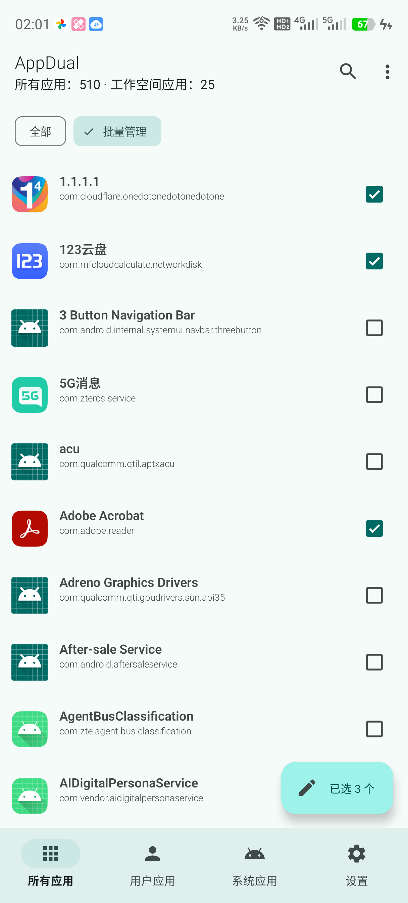
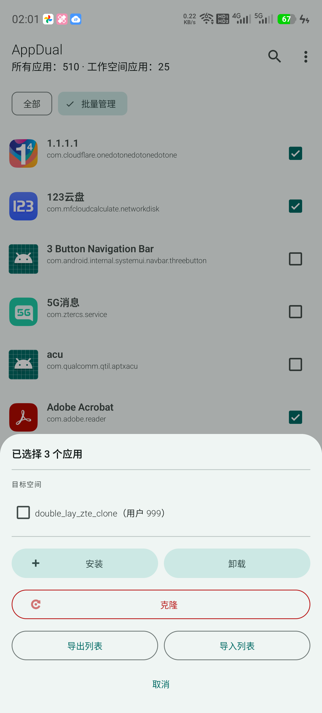

# AppDual
A multi‑instance app manager powered by **Shizuku** or **root**.

## Overview
AppDual is a lightweight utility that uses Shizuku or root privileges to manage Android workspaces (Managed Profiles).

It allows you to create isolated or shared environments for apps, enabling multiple parallel installations of the same application without heavy virtualization.

Beyond one‑app‑at‑a‑time management, AppDual also has a **batch mode**: select multiple apps at once (long‑press an app, or tap "Batch Manage"), then install, uninstall, or **clone** them across one or more workspaces in a single operation. Clone makes a target workspace's app set match your selection exactly — installing what's missing and removing everything else — with a safety check that refuses to run against an obviously partial selection. Selections can also be exported to / imported from a JSON file via the system file picker, so you can save and reuse an app list across workspaces or devices.

## ⚠️ Important Warning

Always back up your files before performing any workspace‑related operations. Creating or removing managed workspaces involves Android’s multi‑user system; unexpected behavior from OEM restrictions may lead to data loss or even bootloop.
**Proceed only if you understand the risks.**

## ⚠️ 重要提醒
在进行任何与工作空间相关的操作之前，请务必备份。创建或删除工作空间涉及 Android 多用户系统，某些 OEM 限制可能导致数据丢失风险甚至设备启动问题。**请在充分了解风险并完成备份后再继续。**

## 🚀 Getting Started
1. **Choose an execution mode:** AppDual can run `pm`/`am` commands either through [Shizuku](https://shizuku.rikka.app/) or directly through **root** (`su`) — toggle this in the **Settings** tab under "Execution Mode". Root, if detected, bypasses Shizuku/ADB entirely.

   (**Note:** In some devices, you need to allow Shizuku full permission of auto-start/chained wake-up/mutual wake-up, or battery usage unlimited.)

2. **Permissions:** Grant the app Shizuku permissions when prompted (not needed if using root).

3. **Management:** Use the **Settings** tab to create a new profile (Managed/Clone) if not exist, or you can edit packages in an existing workspace.

    (**Note:** Managed space is an isolated environment from main user while cloned space using shared storage. Cloned space may not work in all devices.)

4. **Batch management:** Long‑press any app (or tap "Batch Manage" in the app list) to enter selection mode, pick apps, then tap the floating button to install/uninstall/clone them across workspaces, or export/import the selection as a list.

## 📸 Screenshots

## ⚖️ License
This project is licensed under the GNU General Public License v3.0 (GPLv3).
You may copy, distribute, and modify the software as long as modifications are documented and remain under GPLv3.
For the full license text, please search for the GNU GPL v3.0.
